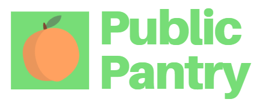

Public Pantry is a free-to-use web application that allows farmers and users to connect with and directly sell to consumers in their local communities. Individuals can log their food with expiration dates and get notifications that encourage users to either donate soon-to-expire food or compost expired food. If users no longer want an item, they can put the item up for donation as long as it has not expired. Other individuals can then go to the marketplace feed and claim donations as well as buy from local farmers. To draw more users to the platform and gamify food conservation, users can get rewards points for their eco-friendly behavior and exchange it for gift cards from sponsors or donate to charity.

## Inspiration
The problems we are facing in the current global pandemic are exposing just how fragile our food supply chains are. Farmers are being forced to destroy their crops and dispose of their livestock, which further contributes to the global food waste problem. In just the USA and Canada alone, about 250,000 tons of food is wasted each day. Not only is this devastating to the environment, but this is also a completely unsustainable way to live. Furthermore, the food must travel very far and go through shipping and a lot of processing before reaching consumers, further polluting the Earth. We seek to close the gap between farmers and consumers and eliminate the food waste problem.

## How it's built
**Frontend:**
Public Pantry was built using React, which encompasses HTML, CSS, and Javascript. We used HTML to build the foundation for all the pages of the application and styled them using CSS. We also used a concept called routing in order to tie all of our React Components together. 

**Backend:**
Public Pantry gets its data from a real-time database that we built using MongoDB Atlas. Using Node.js, Express, and Mongoose, we were able to build a REST API and connect the database to our front-end application and receive and send data to and from our application. Lastly, we used Heroku to host our web app.

## Conclusion
By connecting the community in this way, not only is the gap in the fragile food supply chain filled, people can participate in food conservation in multiple ways while getting rewarded for it. Furthermore, the massive amounts of energy and emissions that go into the food supply chain can be eliminated through the direct producer to consumer relationships. With everyone's pantry becoming a Public Pantry, we can build a greener future and not have to pass on our burdens to the next generation.

## How to enjoy Public Pantry
**Option 1:**

You can visit this link https://fathomless-woodland-86230.herokuapp.com/, where you can interact with the deployed application on Heroku. 

You can log in using the username `simplysai`

**Option 2:**

First clone the entire repository from GitHub and load it into a local machine. 

Download node.js.

Then, run `npm install` in the root directory of the submission.

Next, go into the directory titled `pp-react` and and also run `npm install`.

Finally, go back to the root directory of the submission and run `npm run dev`.

You can log in using the usernames `simplysai`
